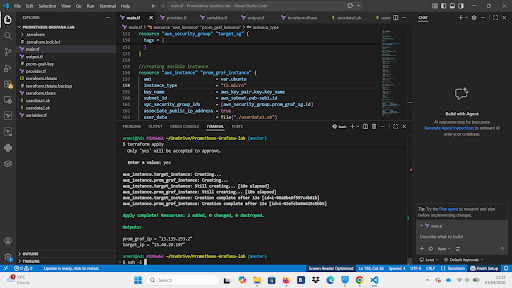
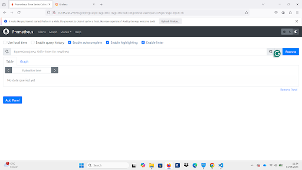
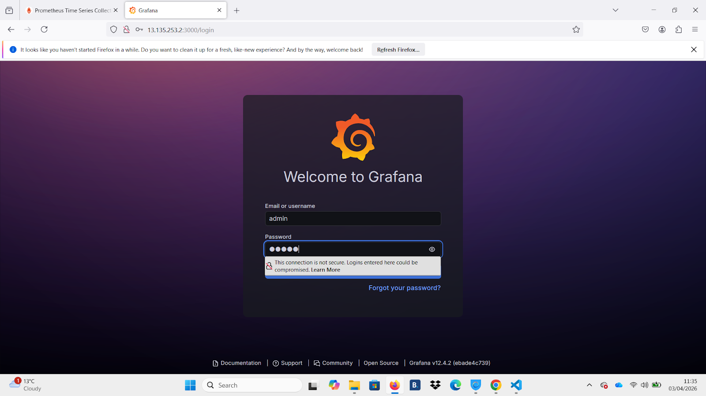
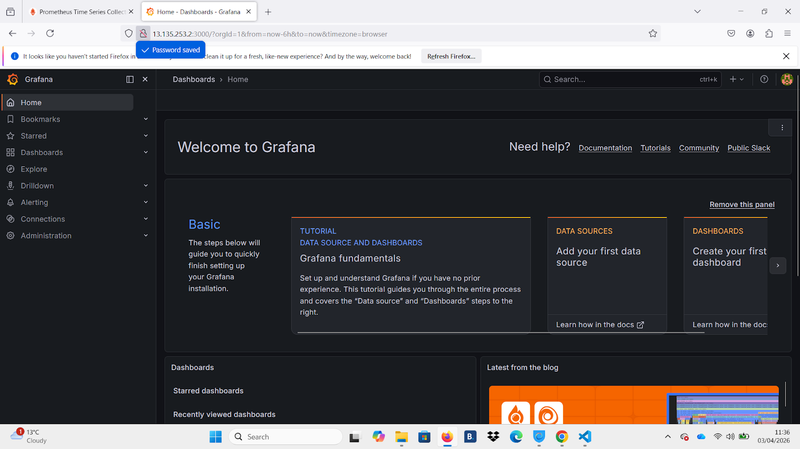
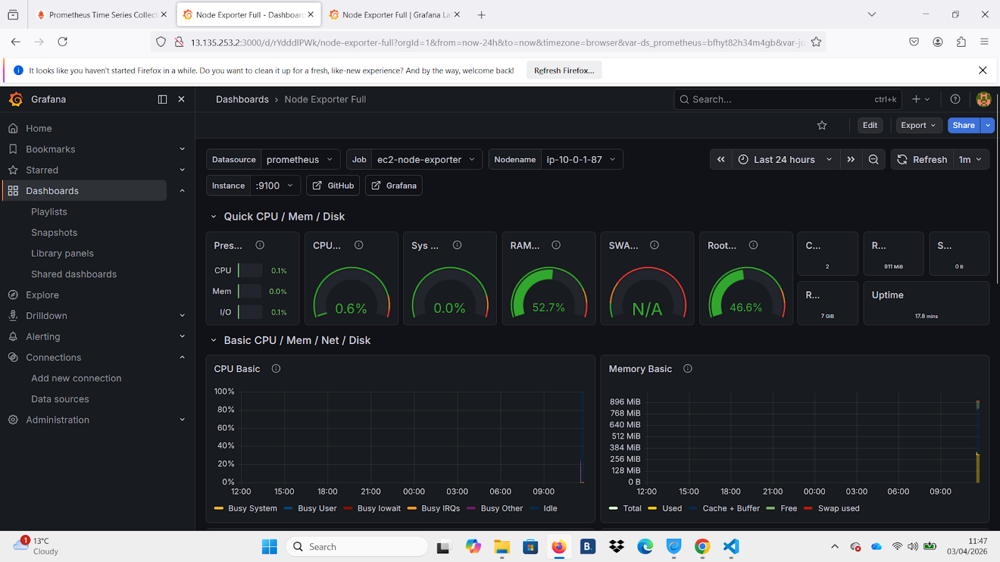

# Prometheus Grafana Terraform Lab

## Overview

This project provisions AWS infrastructure using Terraform and deploys a complete monitoring stack consisting of Prometheus and Grafana on an EC2 instance.

The setup uses user data scripts to automatically install Docker and run both services, making them accessible via public endpoints.

---

## Architecture

The infrastructure consists of:

- AWS EC2 instance provisioned via Terraform  
- Security Group allowing access to required ports  
- Docker used to run Prometheus and Grafana containers  
- Prometheus exposed on port 9090  
- Grafana exposed on port 3000  

---

## Project Structure

```bash
.
├── main.tf
├── provider.tf
├── variables.tf
├── output.tf
├── userdata1.sh
├── userdata2.sh
├── screenshots/
└── README.md
```

---

## Prerequisites

- Terraform installed  
- AWS account  
- AWS CLI configured (`aws configure`)  
- SSH key pair (or Terraform-managed)  

---

## Setup & Deployment

```bash
git clone https://github.com/adz3k/prometheus-grafana-terraform-lab.git
cd prometheus-grafana-terraform-lab
```

Copy variables file:

```bash
cp terraform.tfvars.example terraform.tfvars
```

Run Terraform:

```bash
terraform init
terraform plan
terraform apply
```

---

## Screenshots (Proof of Deployment)

These screenshots demonstrate that the infrastructure was successfully provisioned and the monitoring stack is running.

### Terraform Apply


### Prometheus Running


### Grafana Login


### Grafana Dashboard


### Metrics Visualization


---

## What This Project Demonstrates

- Infrastructure as Code (Terraform)  
- AWS EC2 provisioning  
- Automated environment setup using user data  
- Containerised monitoring stack using Docker  
- Prometheus and Grafana integration  
- End-to-end monitoring solution deployment  

---

## Notes

- Sensitive files such as `.tfvars`, state files, and private keys are excluded via `.gitignore`  
- Ensure AWS Free Tier limits are respected  

---

## Future Improvements

- Add remote Terraform state (S3 + DynamoDB)  
- Use Auto Scaling Group instead of single EC2  
- Add Application Load Balancer  
- Integrate alerting (Prometheus Alertmanager)  
- Extend monitoring with node exporters  

---

## Author

Armstrong Lawal  
BSc (Hons) Computing Graduate  
Aspiring Cloud / DevOps Engineer
